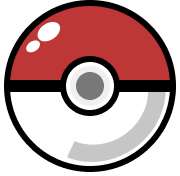

<div id="top"></div>

# Who's that Pokémon 

## Project setup

```
npm install
```

### Compiles and hot-reloads for development

```
npm serve
```

### Compiles and minifies for production

```
npm build
```

### Run your unit tests

```
npm test:unit
```

<p align="right"><a href="#top">🔝</a></p>

<p align="center">Made with ❤️ and ☕️ by Aitor Lancharro</p>
